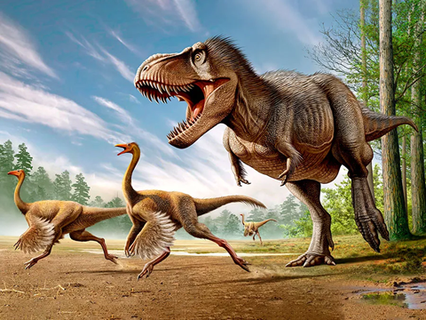
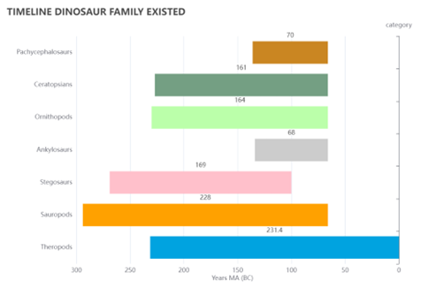

# Project 3 Data Visualization: Jurassic Project

### Background and Context:

* We have chosen our theme to be based on where dinosaur bones/fossils have been found around the world and which Family/Genus these dinosaurs belonged to. 
* The approach we took was to export data using both an API call and Web Scrapping techniques followed using SQLite as our database. 
* We have created a HTML and JS dashboard containing a menu along with multiple charts, that can be updated from the data stored in our database.
* We have used graphs from the Echart.JS Library in our dashboard and plot the dinosaur fossils map from mapbox
* Our data contains 1000 of records but we have reduced this by removing non-dinosaur fossils as they would not fit onto the Heroku server.

### Challenges and limitations:

Lack of all data variety and consistency: Using an API call we pulled the data of all the locations that fossils have been found across the world. From the pulled data we only kept specific data that either related to the family/group of the fossil, the location the fossil was found and age of the fossil. Due to the data sources’ limitation and dinosaur classes limitation, we have to merge two sources of data which cause the data consistency issue and with some of the data category null. We have dropped the Na and cleaned them and made all data to be available to match the location of the fossils in latitude and longitude which will be used in our map markers on our HTML page.

Limited data exploration broadness: due to the scientific language of dinosaur study, we cut down few aspects of data columns to be more readable and interesting. And due to the large volume data, we have to limit the data scale in breadth and depth.

Data volume and visualisation limitation due to size of Heroku: Heroku has a limit of size around 8M we cut of heaps of data and squeeze it to be able to fix with Heroku. Besides, as the Heroku will be only free till November, the access to the application will not be available for free. We may consider for another application to continue run this html. This will be a limitation for the data visualisation.
   
### Data Process and Database:

Web scrapping was used to separate the dinosaur fossils into the few major groups, as the original data didn’t separate the fossils into these categories. This was done because these few major groups are generally recognisable by both Scientists and even Children. The other categories are far too broad and would make it harder to understand and follow as there are literally 1000’s of different Genera. These three major categories are used for visualisation in the html.

* First database: Data from API call:
Cleaned the data including dropping Family and Order columns 
Fossils aren't able to be classified with certainty due to incompleteness
* Second database: Data from Web scraping:
Dropped Scientific Name and Species columns 
* Merge database & Flask API:
We merged the data on the "genus" column to complete our database
We dropped the duplicate rows as part of our cleaning process to make sure that the data would fit onto Heroku
The database was loaded into SQLite
The Flask API was created to call upon data from our database

### Data Visualisation and HTML:
## Pie chart:
We used Graphs from the Echart.js library for visualization like pie chart
The chart groups the dinosaurs by Genus and shows a distribution of how many fossils of each Genus have been found
We showed this chart to group each Genus into the 3 Major groups that were mentioned previously
Image of chart

## Timeline Bar chart:
We used a Horizontal Bar Graph shows the timeline when various dinosaur family existed in millions of years (BC).
The graph shows the sudden mass extinction of three-quarters of the plant and animal species on Earth, approximately 66 million years ago.
Theropods evolved to become modern day birds which is why they are present after the major extinction event.
The Sauropods were the first known family of dinosaur which included the Brontosaurus and Brachiosaurus.
Image of chart

## Worldmap of Dinosaur Fossils
We used Mapbox ploted the world map where the dinosaur fossils found by the data of latitude and longitute with its genus and classification
In the map, we also have the popup providing details of its generation of class , genus, existing time in MA and the found location 

## The visualization process workflow consists of two parts: 

Backend: From back end: App.py, python extracts data information from database: reframed it and set the data in a new array to  be ready to present at the front end html. 

Front end: At the front end: we imported Apache E-charts library, to help drawing the data charts by interacting the data from the back end. Also, the JQuery library helps with the Dom manipulation and simplified JavaScript with efficiency. The Ajax requests the data from back-end to front end, And with the help of Echarts library and CSS it transformed the data and presented as visualised data graph on the dashboard.

### Heroku Development:
We did the exercise of Heroku and installed the application within the size limitation. 
The link can be accessed by: https://dinosaurmap.herokuapp.com/

